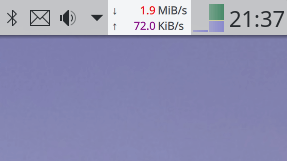

# plasma-applet-netspeed-widget

Plasma 5 widget that displays the currently used network bandwidth.

**Important: Starting with Plasma 5.22 you may need to manually install the package `ksysguard`.**



Dependencies:

* ksysguard

Optional dependencies:

* plasma-addons

  May be called plasma5-addons or similar. Used to launch a user defined application when the applet is clicked.

## Installation

### From openDesktop.org

1. Go to [https://www.opendesktop.org/p/998895/](https://www.opendesktop.org/p/998895/).
2. Click on the `Files` tab.
3. Click the `Install` button.
4. Make sure the package `ksysguard` is installed.

### From within the Plasma workspace

1. If your widgets are locked, right-click the desktop and select `Unlock Widgets`.
2. Right-click the desktop and select `Add Widgets...`.
3. Click the `Get new widgets` button in the Widget Explorer that just opened.
4. Type `Netspeed Widget` into the search field.
5. Click the `Install` button next to "Netspeed Widget".
6. Make sure the package `ksysguard` is installed.

### From source

```bash
git clone https://github.com/dfaust/plasma-applet-netspeed-widget
cd plasma-applet-netspeed-widget
mkdir build
cd build
cmake -DCMAKE_INSTALL_PREFIX=/usr ..
make
sudo make install
```

Dependencies:

* cmake
* extra-cmake-modules
* plasma-framework-devel
